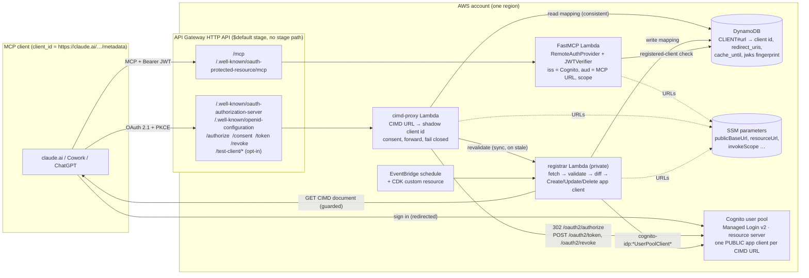
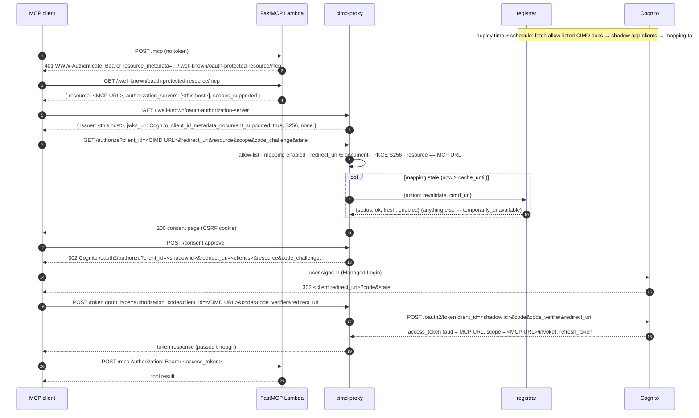

# Serverless CIMD authorization for MCP servers with Amazon Cognito as the token issuer

Let MCP clients that identify themselves with **OAuth Client ID Metadata Documents (CIMD)**, such as claude.ai, Claude Desktop, Cowork, and ChatGPT connectors, sign users in through an **Amazon Cognito user pool** and call a serverless **MCP server**, while **Cognito stays the token issuer**. Everything is AWS CDK (TypeScript) plus three small Python Lambdas. No secrets, no Dynamic Client Registration, no custom token minting.

---

## 1. Why this repository

**The problem.** The MCP authorization spec makes CIMD the preferred way for a client to identify itself: the `client_id` is an HTTPS URL that hosts the client's metadata (see the [MCP announcement of the 2026-07-28 specification](https://blog.modelcontextprotocol.io/posts/2026-07-28/)). As of September 2026, Amazon Cognito user pools do not accept URL client IDs, do not implement Dynamic Client Registration, and do not publish RFC 8414 authorization-server metadata. If you want a Cognito-backed MCP server that claude.ai or ChatGPT can add by URL, something has to translate.

**What this repo does.** It adds a thin, serverless translation layer *around* Cognito, not in front of its tokens:

| Piece | Role |
|---|---|
| **cimd-proxy** (Lambda) | The authorization-server façade clients see: RFC 8414 metadata, `/authorize` with a consent page, `/token`, `/revoke`. Maps a CIMD URL to a Cognito app client and forwards. Mints nothing, holds no keys. |
| **registrar** (private Lambda) | Fetches allow-listed CIMD documents with SSRF guards, validates them, and creates one Cognito *shadow app client* per CIMD URL. Re-runs on deploy and on a schedule, and synchronously on demand when the proxy sees stale metadata. |
| **MCP server** (Lambda) | [FastMCP](https://gofastmcp.com) in resource-server mode. Verifies Cognito JWTs (issuer, audience, scope) and serves RFC 9728 protected-resource metadata. One demo tool. |
| **Cognito** | Issuer, JWKS, Managed Login v2, PKCE verification, exact redirect-URI enforcement, refresh and revocation. |

**Why you might want it**

- You need a CIMD-compatible authorization layer for MCP and want Cognito to remain the system of record for users and tokens.
- You want the reference security controls written down: allow-list, SSRF-guarded fetch, resource binding (`aud`), key-rotation detection, fail-closed freshness, CSRF-protected consent, least-privilege IAM, `cdk-nag` clean.
- You want a deployable sample, not a diagram: `cdk deploy --all` gives you a working MCP server that a real claude.ai connector can add by URL.

**When you should not use it**

- Your MCP clients are known at deploy time. Pre-register one Cognito app client per client and skip all of this.
- Your clients are desktop or CLI tools with `localhost` redirect URIs (Codex, Claude Code, VS Code). Cognito matches callback URLs exactly and cannot do RFC 8252 variable ports; see [§4 Client compatibility](#4-client-compatibility).
- Your identity provider handles CIMD natively. The translation layer here exists only to fill that gap; if it is not needed, delete the proxy and registrar and keep the user pool, the tokens, and the MCP server exactly as they are.

---

## 2. Architecture

### Components



Plain-text version of the same picture:

```
 MCP client ──── MCP (Bearer Cognito JWT) ────► HTTP API ─► /mcp ─────────────► FastMCP Lambda: iss=Cognito, aud=MCP URL, scope, registered client
 client_id = https://claude.ai/…            │      /.well-known/oauth-protected-resource/mcp → authorization_servers=[this host]
        │                                   │
        │ OAuth 2.1 + PKCE                  ├─► /.well-known/*  RFC 8414: issuer=this host, jwks_uri=Cognito, client_id_metadata_document_supported
        │                                   ├─► /authorize      allow-list → mapping → freshness → consent → 302 Cognito (shadow client id)
        │                                   └─► /token /revoke  map client_id → forward to Cognito (PKCE verified by Cognito)
        │
        └── sign in ──► Cognito Managed Login ──► 302 code to the client's own redirect_uri (Cognito enforces exact match)

 registrar (private): deploy-time + hourly + on demand ── fetch CIMD (SSRF-guarded) → validate → diff → Cognito app client → DynamoDB
```

### Authorization sequence



### `/.well-known/openid-configuration` is a discovery fallback, not an OIDC Provider document

cimd-proxy serves the same RFC 8414 authorization-server metadata at both `/.well-known/oauth-authorization-server`
and `/.well-known/openid-configuration`, because some MCP clients still probe the OpenID path first. **The second
path does not make this an OpenID Connect Provider.** The document advertises `issuer` = this host, while access
tokens are issued and signed by Cognito and carry `iss` = `https://cognito-idp.<region>.amazonaws.com/<poolId>`.
That is the whole point of the design — the façade is ours, the tokens are Cognito's — but it means the two values
differ, which is precisely the shape an issuer-confusion attack exploits.

So, if you copy this pattern: **a resource server MUST keep validating `iss` against the token issuer it trusts
(Cognito), not against the `issuer` it discovered from this metadata.** Do not treat the façade's `issuer` as an
OIDC issuer, do not fetch an ID token from it, and do not let a client's discovered `issuer` become the value a
resource server accepts in `iss`. The FastMCP `JWTVerifier` in `lambdas/mcp_server/verifier.py` is configured with
the Cognito issuer and JWKS URL directly, from `TOKEN_ISSUER`/`TOKEN_JWKS_URL`, and never from discovery.

### Rate limiting and WAF

The only rate control this sample deploys is API Gateway request throttling: `api.throttle` (50 rps / 100 burst) on
the `$default` stage, and a tighter `api.revalidatingRouteThrottle` (10 rps / 20 burst) on the three routes that can
cause outbound work: **`GET /authorize`, `POST /consent` and `POST /token`**. On a stale mapping the proxy
synchronously asks the registrar to revalidate, which fetches the client's CIMD document and possibly its JWKS. All
three routes reach that path before any credential is checked — `/token` resolves the mapping before it validates the
grant — so throttling `/authorize` alone would leave the same amplification reachable through `/token`. The
amplification is already bounded by the registrar's DynamoDB lock, the 3-second fail-closed wait and the guarded
fetch's wall-clock deadline, so it is an availability concern rather than an authorization bypass — but it is still
worth throttling separately.

**There is no AWS WAF web ACL in this sample, and you should add one before exposing a deployment to untrusted
traffic.** AWS WAF cannot be associated with an API Gateway *HTTP* API; the supported regional resource types are
REST APIs, Application Load Balancers, AppSync GraphQL APIs, Cognito user pools, App Runner services and a few
others. This sample uses an HTTP API deliberately: the `$default` stage passes `WWW-Authenticate` through unmodified
(a REST API rewrites it to `x-amzn-remapped-www-authenticate`, so MCP clients never see `resource_metadata`) and it
has no stage path, so the RFC 9728 well-known URLs resolve at the host root. Adding WAF therefore means fronting the
API with CloudFront and attaching the web ACL there, which is the `edge.enabled` profile — reserved in `config.ts`
and **not implemented in this release** (`bin/app.ts` fails fast if you set it). Note that switching to that profile
changes `publicBaseUrl`, and therefore `resourceUrl`, the token `aud`, the invoke scope and the Cognito
resource-server identifier: it is a breaking migration, not a toggle. At minimum, attach a rate-based rule.

### Vocabulary that the code uses everywhere

| Name | Meaning | Value |
|---|---|---|
| `publicBaseUrl` | where clients reach the API | the HTTP API URL, e.g. `https://<api-id>.execute-api.<region>.amazonaws.com` |
| `authorizationServerUrl` | issuer advertised in RFC 8414 metadata, served by cimd-proxy | `= publicBaseUrl` |
| `resourceUrl` | canonical MCP URL, RFC 8707 `resource`, Cognito resource-server identifier, token `aud` | `${publicBaseUrl}/mcp` |
| `invokeScope` | the one scope the MCP server requires | `${resourceUrl}/invoke` |
| `tokenIssuer` | `iss` in access tokens | `https://cognito-idp.<region>.amazonaws.com/<poolId>` |

`authorizationServerUrl` and `tokenIssuer` are deliberately different: the façade is ours, the tokens are Cognito's.

### Security properties in one place

| Property | Where enforced |
|---|---|
| Only allow-listed CIMD URLs get app clients | `config.ts` → registrar; proxy refuses unmapped `client_id` at `/authorize` and `/token`; only shadow clients hold `invokeScope`. The list is **empty by default**: a fresh deploy trusts nobody until an operator adds a URL |
| Redirect URI | proxy pre-check (exact string ∈ document); Cognito exact match on the shadow client's callback URLs |
| PKCE S256 required | proxy; verified by Cognito |
| Token audience | proxy forwards `resource`; Cognito binds `aud`; FastMCP checks it |
| CIMD fetch SSRF | registrar only: https, no redirects, RFC 6890 block after DNS (including multicast and reserved ranges), pinned connection, 5 KB streaming cap, 3 s socket timeout and an enforced 6 s wall-clock deadline (bounded DNS, chunked reads) |
| Rate limiting | API Gateway stage throttle, plus a tighter per-route throttle on `GET /authorize`, `POST /consent` and `POST /token` — every route that can trigger a registrar revalidation. **No WAF** — see [Rate limiting and WAF](#rate-limiting-and-waf) |
| Stale or changed metadata | registrar diff matrix; key-material change rotates the app client (old refresh tokens die); proxy fails closed until revalidated |
| Consent CSRF | `__Host-` double-submit cookie, no signing key |
| Secrets | none: public PKCE clients only, no client secrets, no signing keys |
| IAM | proxy has no `cognito-idp:*`; registrar is the only principal that can touch app clients; all roles scoped to one table, one pool, one SSM prefix |
| Logging | structured JSON with redaction of tokens, codes, `state`, cookies, `Authorization` |

---

## 3. Repository and documentation structure

```
.
├── README.md                  ← you are here: overview, deploy, operate
├── AGENTS.md                  ← rules and commands for AI coding agents working in this repo
├── SECURITY.md                ← how to report a vulnerability; what to add before internet exposure
├── CONTRIBUTING.md, CODE_OF_CONDUCT.md, LICENSE (MIT-0), NOTICE
├── config.ts                  ← THE single source of every configurable value (validated at synth)
├── bin/app.ts                 ← CDK app: UserPoolStack → DataStack → ApiStack → RegistrationStack
├── lib/                       ← CDK stacks, derive.ts (URL derivations, config validation), nag suppressions
│   └── constructs/python-lambda.ts   Docker-free Python bundling from uv.lock
├── lambdas/
│   ├── shared/                ← cimd_url rules, mapping_store (read side), runtime_config (SSM), logging (redaction)
│   ├── mcp_server/            ← FastMCP app, ScopedVerifier (scope + registered-client check), Mangum handler
│   ├── cimd_proxy/            ← proxy_app (router), oauth, freshness, consent, cognito_relay, test_client
│   └── registrar/             ← fetcher (guards), validate, reconcile (diff matrix), cognito_ops, store (lock, transactions)
├── tests/
│   ├── unit/                  ← pytest, no AWS (263 tests)
│   ├── cdk/                   ← jest assertions + cdk-nag (98 tests)
│   ├── fixtures/              ← client-identifier-URL verdict table asserted by BOTH suites, so the
│   │                            TypeScript and Python URL validators cannot drift apart (gen_cases.py regenerates)
│   └── e2e/                   ← reserved for deployed end-to-end tests
├── pyproject.toml, uv.lock    ← Python dependency versions (never in config.ts)
└── package.json               ← CDK and test tooling versions
```

Every non-empty Python implementation module and Python test file opens with a docstring stating what it implements or protects, and every CDK stack and construct class has a JSDoc comment; together with this README and `AGENTS.md` they are the documentation of record.

---

## 4. Client compatibility

This design needs two things from a client: a CIMD `client_id`, and an **https** redirect URI that Cognito can match exactly. It cannot return RFC 9207 `iss` on authorization responses because Cognito redirects directly to the client.

`cimd.allowedClients` ships **empty**, so no client in this table works until you add its URL to `config.ts` and deploy. `config.ts` exports `KNOWN_CIMD_CLIENTS` as reference data for copying, but nothing there is trusted until it is on the allow-list.

| Client | CIMD document | Redirect | Works | Allow-list entry |
|---|---|---|---|---|
| claude.ai web, Claude Desktop, Claude mobile, Cowork | `https://claude.ai/oauth/mcp-oauth-client-metadata` | `https://claude.ai/api/mcp/auth_callback` | yes | add that URL, redeploy |
| ChatGPT connectors / Apps | `https://chatgpt.com/oauth/<callback_id>/client.json` (per connector, shown in the connector's settings) | `https://chatgpt.com/connector/oauth/<callback_id>` | yes | add that URL, redeploy |
| Built-in test client (`testClient.enabled`) | served by the proxy itself | same host | yes | automatic |
| Codex, Claude Code, VS Code / Copilot, Cursor, Gemini CLI | loopback `http://127.0.0.1:<port>/…` or DCR | no | not supported by design (see §12) |

---

## 5. Prerequisites

| Tool | Version | Why |
|---|---|---|
| AWS account + credentials | admin-ish for first deploy | creates Cognito, DynamoDB, API Gateway, Lambda, IAM, SSM, EventBridge |
| AWS CLI v2 | current | bootstrap, user creation, verification |
| Node.js | 22.x (20+ works) | CDK CLI and `ts-node` |
| npm | comes with Node | `aws-cdk` 2.1121+, `aws-cdk-lib` 2.220+, jest |
| Python | **3.12.x** | Lambda runtime; also used for local tests |
| [uv](https://docs.astral.sh/uv/) | 0.8+ | resolves `uv.lock` and cross-installs Lambda dependencies for `aarch64-manylinux2014`. **No Docker needed.** |
| CDK bootstrap | once per account/region | `npx cdk bootstrap aws://<account>/<region>` |

Some accounts require every IAM role to carry a permissions boundary; set `iam.permissionsBoundaryArn` in `config.ts` (or via override, see below) before the first deploy.

---

## 6. Deploy

```bash
# 1. clone and install tooling
git clone <this repo> && cd sample-serverless-architecture-cimd-with-cognito
npm ci
uv sync --all-groups            # creates .venv with dev tools (pytest, ruff, moto …)

# 2. review config.ts — at minimum:
#    cimd.allowedClients        REQUIRED: empty by default, so synth fails until you paste the client
#                               identifier URL(s) you intend to trust. The error lists the known candidates.
#                               For a first deploy you can leave it empty and set testClient.enabled = true
#                               instead: the built-in test client registers itself.
#    project.region, project.stage
#    iam.permissionsBoundaryArn (only if your account mandates one)
#    testClient.enabled = true  (recommended for the first deployment so you can verify without claude.ai)

# 3. validate locally
npm run build                   # tsc
npx jest                        # CDK assertions + cdk-nag
uv run pytest                   # Lambda unit tests
npx cdk synth --quiet

# 4. bootstrap once, then deploy all four stacks in dependency order
npx cdk bootstrap aws://<account>/<region>
npx cdk deploy --all --require-approval never
```

Outputs you will use:

| Output | Stack | Meaning |
|---|---|---|
| `PublicBaseUrl` | registration | `publicBaseUrl` — the MCP server host |
| `ResourceUrl` | registration | the URL to add as a connector in claude.ai |
| `InvokeScope` | registration | the scope shadow clients receive |
| `LoginBaseUrl` | userpool | Cognito Managed Login domain |
| `UserPoolId` | userpool | for user administration |

The deploy-time registrar run fetches every allow-listed CIMD document and creates the shadow app clients before the stack completes, so the first `/authorize` already has mappings. If a document is unreachable or invalid, the deployment fails loudly with the reason.

### Environment-specific overrides without editing `config.ts`

`CIMD_CONFIG_OVERRIDES` is a JSON object merged shallowly per top-level key at synth time. Useful for CI or a personal dev account:

```bash
export CIMD_CONFIG_OVERRIDES='{
  "iam": {"permissionsBoundaryArn": "arn:aws:iam::<account>:policy/<boundary>"},
  "testClient": {"enabled": true, "path": "/test-client/metadata.json"}
}'
npx cdk deploy --all --require-approval never
```

Deploy with the same overrides every time. Dropping one later is a real change (for example, removing the test client deletes its shadow client and route), so read `cdk diff` before deploying.

### Create a user to sign in with

The pool has no self sign-up. Either set `cognito.createDemoUsers: true` (users are created without a password), or create one directly. Passwords are set at use time, never stored in config:

```bash
aws cognito-idp admin-create-user --user-pool-id <UserPoolId> --username alice \
  --user-attributes Name=email,Value=alice@example.com Name=email_verified,Value=true --message-action SUPPRESS
aws cognito-idp admin-set-user-password --user-pool-id <UserPoolId> --username alice --password '<choose>' --permanent
aws cognito-idp admin-add-user-to-group --user-pool-id <UserPoolId> --username alice --group-name mcp-users
```

---

## 7. Verify

**With the built-in test client** (`testClient.enabled: true`): open `<PublicBaseUrl>/test-client/index.html`, click *Sign in and authorize*, approve the consent page, sign in. The callback page exchanges the code at `/token`, calls `tools/list` and `tools/call` on `/mcp`, and offers *Refresh* and *Revoke*. Raw tokens are never displayed, only decoded claims.

**With claude.ai**: Settings → Connectors → Add custom connector → paste `ResourceUrl` → Connect. You should see the consent page, then Cognito Managed Login, then a connected connector. Ask Claude to call the tool; the reply contains `mcp.replyText`.

**From the command line** (no browser):

```bash
B=<PublicBaseUrl>
curl -s $B/.well-known/oauth-authorization-server | jq .          # issuer = $B, jwks_uri = Cognito
curl -si $B/mcp -X POST -d '{}' | grep -i www-authenticate        # 401 with resource_metadata
curl -s $B/.well-known/oauth-protected-resource/mcp | jq .        # RFC 9728 path-suffixed PRM: authorization_servers = [$B]
curl -si "$B/authorize?client_id=https://evil.example/x&redirect_uri=https://evil.example/cb&response_type=code&code_challenge=$(head -c 32 /dev/urandom | base64 | tr -d '=+/' | cut -c1-43)&code_challenge_method=S256" | head -1   # 400 invalid_client, no redirect
curl -s $B/token -d "grant_type=refresh_token&client_id=https://claude.ai/oauth/mcp-oauth-client-metadata&refresh_token=x"   # Cognito's invalid_grant, passed through
```

Mapping rows live in the DynamoDB table (`CLIENT#<cimd url>` and `INDEX#COGNITO#<client id>`); the Cognito console shows one app client per allow-listed URL with the `invoke` scope.

---

## 8. Operate

| Task | How |
|---|---|
| Add or remove a client | edit `cimd.allowedClients`, `cdk deploy`. The registrar creates the shadow client (or disables it, then deletes it one access-token lifetime later). |
| Force a re-fetch of all documents | `aws lambda invoke --function-name <project>-<stage>-registrar --payload '{}' out.json` (scheduled-run semantics; skips if another run holds the lock) |
| Re-validate one client now | `--payload '{"action":"revalidate","cimd_url":"<url>"}'` → `{status, fresh, enabled}` |
| A client rotated its keys | detected on the next fetch: the registrar creates a new app client and retires the old one, so existing refresh tokens stop working. Logged at ERROR. |
| A client's document went bad or unreachable | proxy keeps authorizing until `cache_until`, then asks the registrar; if it cannot revalidate, users get `temporarily_unavailable` with `Retry-After`. After `cimd.maxStaleHours` the client is disabled. |
| Revoke a user's session | the client calls `/revoke` (relayed to Cognito), or an admin runs `admin-user-global-sign-out`. The MCP server refuses a disabled client within `mcp.registeredClientCacheSeconds`. |
| Read logs | three log groups, JSON, redacted. Proxy logs carry the CIMD URL, shadow client id, grant type, upstream status. Registrar logs each reaction (WARN on redirect change, ERROR on key change). |
| Tune | token lifetimes, cache bounds, schedule, consent toggle, throttling: all in `config.ts` (see §9) |
| Destroy | `npx cdk destroy --all` — see [§13 Cleanup](#13-cleanup) |

---

## 9. Configuration reference (most-used keys)

| Key | Default | Notes |
|---|---|---|
| `project.{name,stage,region}` | `cimd-cognito-mcp`, `dev`, `ap-southeast-2` | stack names, login domain prefix, SSM prefix |
| `cimd.allowedClients` | `[]` | **the only clients that ever get an app client.** Empty on purpose: synth fails with the known candidate URLs listed, unless `testClient.enabled` is true |
| `cimd.cacheMinMinutes / cacheMaxHours / maxStaleHours` | 5 / 24 / 72 | RFC 9111 bounds on document caching; disable after this long unreachable |
| `cimd.fetchTimeoutSeconds / fetchDeadlineSeconds` | 3 / 6 | per-socket timeout and the total wall-clock budget for one guarded fetch |
| `api.throttle / api.revalidatingRouteThrottle` | 50·100 / 10·20 | stage-wide request throttle, and the tighter per-route throttle on `GET /authorize`, `POST /consent` and `POST /token` — every route that can trigger a registrar revalidation. Not a WAF substitute — see [§2](#rate-limiting-and-waf) |
| `cimd.registrarSchedule` | `rate(1 hour)` | availability, not the security guarantee |
| `cimd.showConsentInterstitial` | `true` | set `false` to redirect straight to Cognito |
| `cimd.revalidateTimeoutSeconds / unavailableRetryAfterSeconds` | 8 / 10 | proxy → registrar sync call; `Retry-After` when failing closed |
| `cognito.accessTokenMinutes / refreshTokenDays` | 15 / 30 | applied to every shadow client |
| `mcp.enforceRegisteredClient` | `true` | defence in depth on top of the scope gate |
| `mcp.registeredClientCacheSeconds` | 60 | **security parameter, not a performance knob**: the upper bound on how long a warm Lambda container keeps honouring a client the registrar has just disabled or rotated. Lower it to shorten that window, at one DynamoDB read per invocation |
| `mcp.toolName / replyText` | `echo_hello` / `Tool invoked successfully via Cognito + CIMD` | the demo tool |
| `testClient.enabled` | `false` | built-in browser test client, served by the proxy |
| `devFixtures.preRegisteredClient` | `false` | a CDK-created app client with a `localhost` callback for token-level tests |
| `iam.permissionsBoundaryArn` | `""` | applied to every role when set |

Rules: no hard-coded region, URL, host, ARN, name, lifetime or toggle anywhere outside `config.ts`; dependency versions live only in `pyproject.toml`/`uv.lock` and `package.json`; **no URL is ever a Lambda environment variable** (they are written to SSM by the last stack and read at runtime, which is what avoids the API → Lambda → API dependency cycle).

---

## 10. Testing

```bash
uv run pytest -q                 # 263 unit tests: URL rules, fetcher guards, validation, diff matrix, lock,
                                 #   proxy endpoints and error shapes, freshness contract, consent CSRF, verifier, ASGI 401/403
npx jest                         # 98 CDK tests: one $default stage, explicit routes, IAM shapes, no URL in Lambda env,
                                 #   config validation, cdk-nag AwsSolutions with scoped suppressions
uv run ruff check lambdas tests  # lint
```

The curl checks and the built-in test client in §7 cover the deployed stack.

---

## 11. Working with AI coding agents

This repository is written to be navigated by agents (Claude Code, Codex, Cursor, and similar) as well as people.

- **Start with [`AGENTS.md`](AGENTS.md).** It holds the repo rules, the commands, the invariants that must not be broken, and where to update documentation when code changes. Claude Code reads it when no `CLAUDE.md` is present.
- **Design intent lives next to the code.** Every module docstring states the rule it implements and why; ask the agent to read the module docstring and its test file before changing a Lambda.
- **`config.ts` is the only place values live.** An agent that needs a new tunable adds it to the `Config` interface, the defaults, `validateConfig`, the Lambda environment in the stack, the handler, and §9 of this README, in that order.
- **Tests are the contract.** Every unit test file states which behaviour it protects; an agent changing behaviour should change the test in the same commit and keep both suites green.
- **Deployment is reproducible from the CLI** with the commands in §6, and the current deployment's overrides must be re-applied on every `cdk deploy`. Agents should run `cdk diff` and read it before deploying.
- **Verification is scriptable**: the curl checks in §7 and the built-in test client make it possible for an agent to confirm a change end to end without a human in the loop, except for the Cognito sign-in itself.

---

## 12. Out of scope

Out of scope by design: Dynamic Client Registration (never), `private_key_jwt` or client-credentials machine clients, localhost-redirect desktop/CLI clients, MFA and federation showcase, multi-region, streaming MCP responses, AWS WAF and the CloudFront `edge.enabled` profile (see [§2](#rate-limiting-and-waf)), CloudFront caching of any route.

---

## 13. Cleanup

Everything this sample creates is inside the four CDK stacks, so one command removes it:

```bash
npx cdk destroy --all
```

Deploy-time overrides must be supplied to `destroy` as well; `CIMD_CONFIG_OVERRIDES` is read at synth, and
`destroy` synthesises first. Use the same value you deployed with.

What happens, in order:

1. The registrar's CloudFormation **Delete** handler runs first. It deletes every shadow Cognito app client and its
   managed-login branding record, and clears the mapping rows. Client identifiers referencing this deployment stop
   working immediately.
2. The four stacks are removed in reverse dependency order (registration → api → data → userpool).
3. Non-prod stages use `RemovalPolicy.DESTROY`, so the user pool, the DynamoDB table and the log groups go with them.

**`project.stage: "prod"` deliberately retains the user pool and the DynamoDB table** so that a destroy cannot
delete your users or the mapping history. After `destroy` completes on a prod stage, those two resources remain in
the account and must be deleted by hand if you really want them gone:

```bash
aws cognito-idp delete-user-pool --user-pool-id <UserPoolId>
aws dynamodb delete-table --table-name <TableName>
```

Two things are outside the stacks and are not removed:

- The CDK bootstrap stack (`CDKToolkit`) and its assets bucket, shared with every other CDK app in the account.
- CloudWatch log groups that Lambda created implicitly on a failed first deploy, if any. The log groups this sample
  creates explicitly do carry a removal policy.

---

## Security

This is sample code for learning and evaluation. Review the controls in §2 against your own requirements before
production use, and read [§2 Rate limiting and WAF](#rate-limiting-and-waf) before exposing a deployment to the
internet.

If you discover a potential security issue in this project, please notify AWS/Amazon Security through the
[AWS vulnerability reporting page](https://aws.amazon.com/security/vulnerability-reporting/) or by email to
[aws-security@amazon.com](mailto:aws-security@amazon.com). **Please do not create a public GitHub issue.** See
[SECURITY.md](SECURITY.md).

## License

This library is licensed under the MIT-0 License. See [LICENSE](LICENSE) and [NOTICE](NOTICE).
